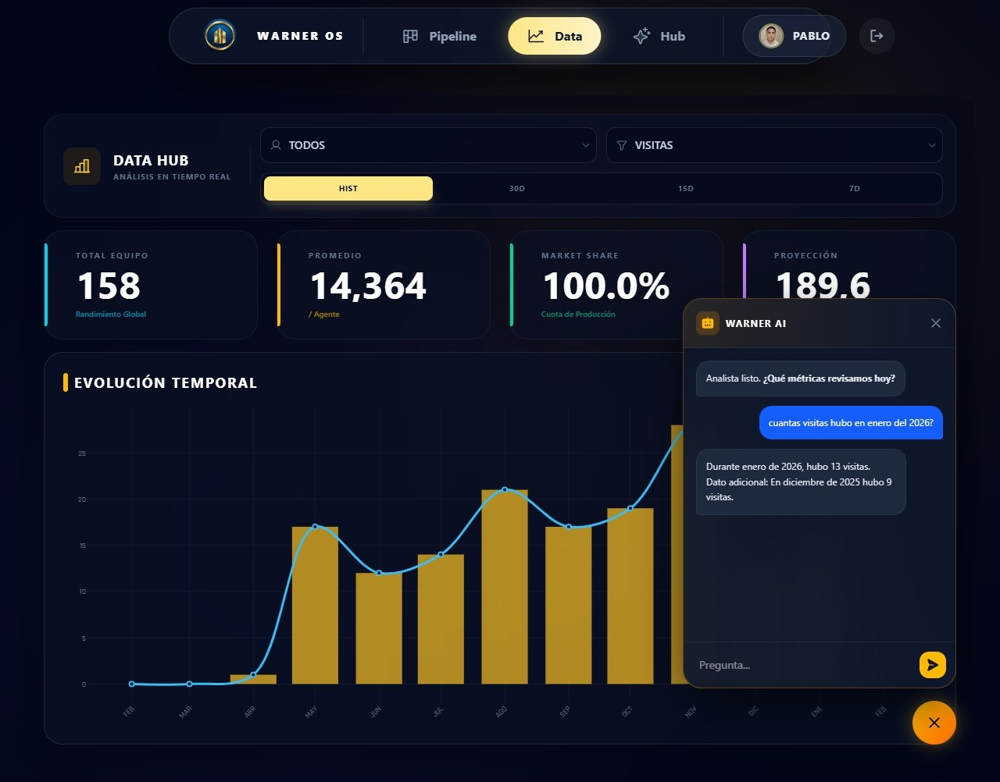
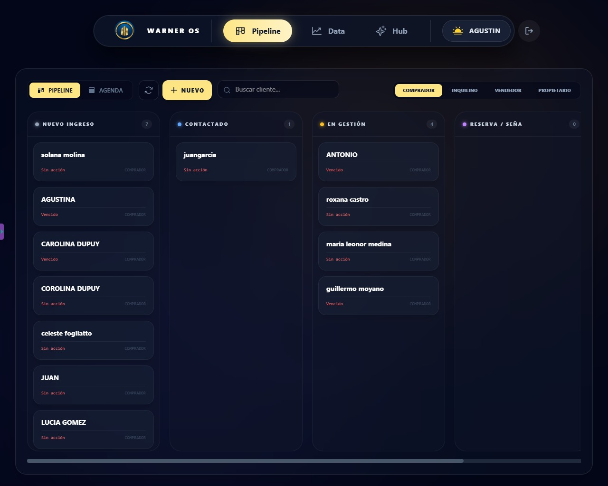
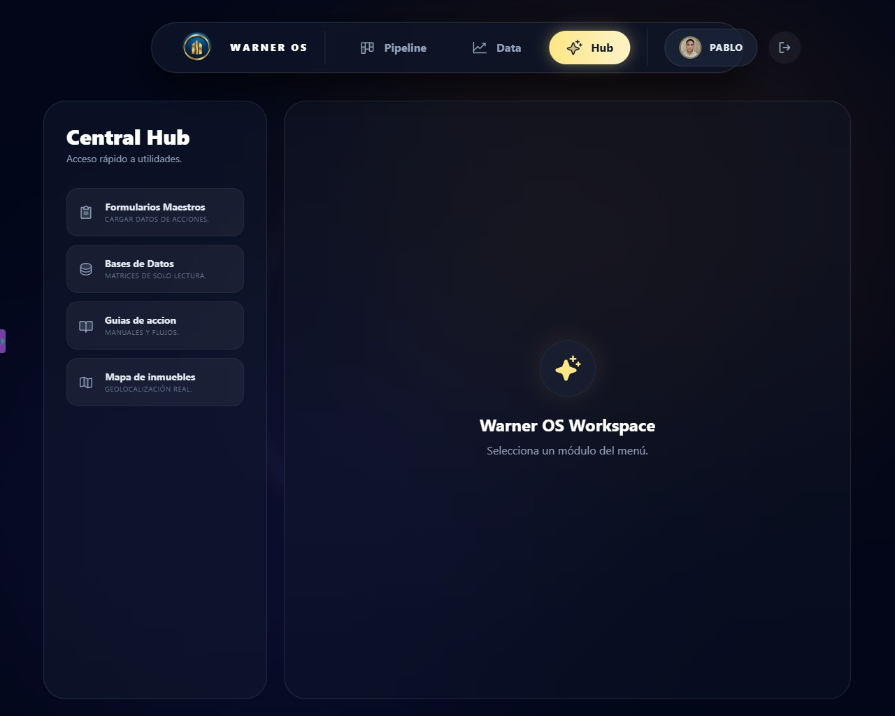
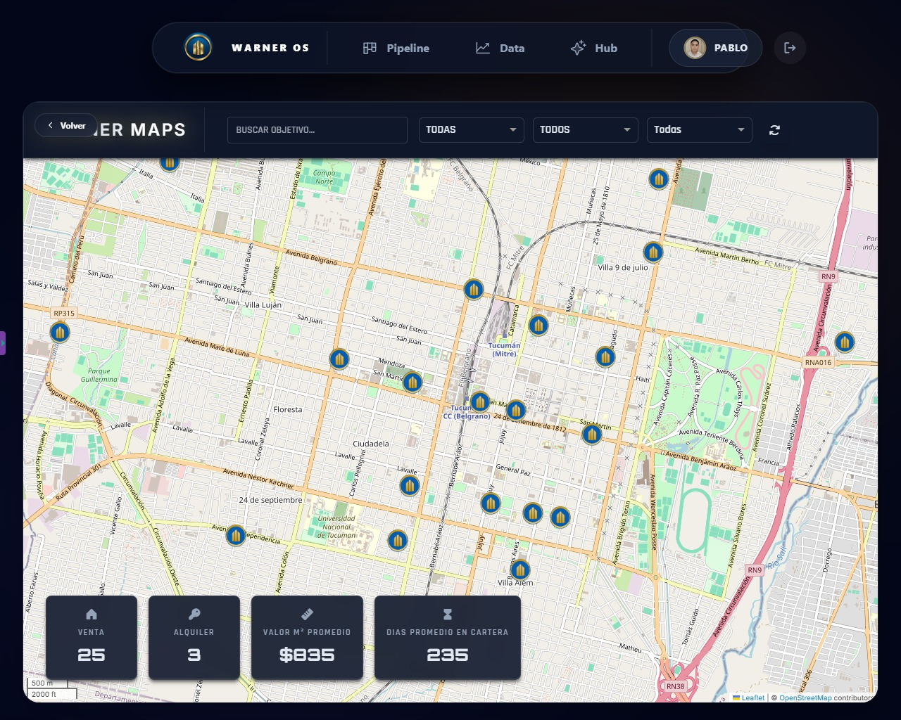

# 🏗️📈 Warner OS - Real Estate Operating System


**Warner OS** es un sistema integral de gestión inmobiliaria (CRM & ERP) de Warner Bienes Raices SAS, diseñado para optimizar el flujo de trabajo de agentes y brokers. Combina una interfaz moderna y reactiva con la potencia de la suite de Google como backend serverless, integrando Inteligencia Artificial para el análisis de datos en tiempo real.

🔗 **Demo Live:** [https://warner-os.vercel.app/](https://warner-os.vercel.app/)
*(Nota: El sistema requiere credenciales corporativas. Para ver el funcionamiento, revisa las capturas abajo o el modo "Mock" local).*

---

## 📸 Capturas de Pantalla

*(¡Sube tus capturas a una carpeta `/screenshots` en tu repo y enlázalas aquí!)*

| Dashboard de Rendimiento + Agente de IA | Pipeline CRM (Kanban) |
|:------------------------:|:---------------------:|
|  |  |

| Central Hub | Mapa de Propiedades |
|:-------------:|:----------------------:|
|  |  |

---

## 🚀 Características Principales

### 🧠 Inteligencia Artificial (Gemini API)
- **Analista de Datos IA:** Chatbot integrado que responde preguntas sobre métricas de negocio ("¿Cuántas ventas hicimos en enero?", "¿Cuál es el agente con mejor conversión?").

### 📊 Business Intelligence & CRM
- **Pipeline Kanban:** Gestión visual de leads desde "Ingreso" hasta "Cierre de contacto".
- **Dashboard en Tiempo Real:** Gráficos interactivos (Plotly.js) que consumen datos directamente de Google Sheets.
- **KPIs Automáticos:** Cálculo de Market Share, promedios por agente y proyecciones de venta.

### 🛠 Herramientas Operativas
- **Gestión de Stock:** Alta de propiedades, tasaciones y control de cartelería.
- **Image Processing:** Recorte y optimización de avatares de agentes en el cliente antes de subir a Drive.
- **Geolocalización:** Integración con mapas interactivos para visualizar la cartera.

---

## 🏗 Arquitectura Técnica

El proyecto utiliza una arquitectura **Serverless** y **Low-Code Backend** para minimizar costos y maximizar la escalabilidad dentro del ecosistema Google.

1.  **Frontend:** - Desarrollado en **React (Vite)**.
    - Estilizado con **Tailwind CSS** y animaciones con **Framer Motion**.
    - Gestión de estado global con **Zustand**.
2.  **Backend (API):** - **Google Apps Script (GAS)** actúa como API REST.
    - Gestiona peticiones `doGet` y `doPost` para CRUD de datos.
    - Maneja la autenticación y la lógica de negocio.
3.  **Base de Datos:** - **Google Sheets** como base de datos relacional simplificada.
    - **Google Drive** para almacenamiento de archivos (imágenes, documentos).

```mermaid
graph LR
A[React Client] -- JSON Request --> B((Google Apps Script))
B -- Read/Write --> C{Google Sheets DB}
B -- Save Files --> D[Google Drive]
B -- Prompt --> E[Gemini AI API]
E -- Response --> B
B -- JSON Response --> A
